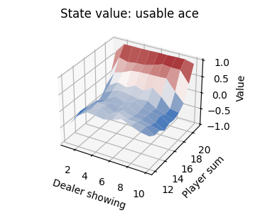
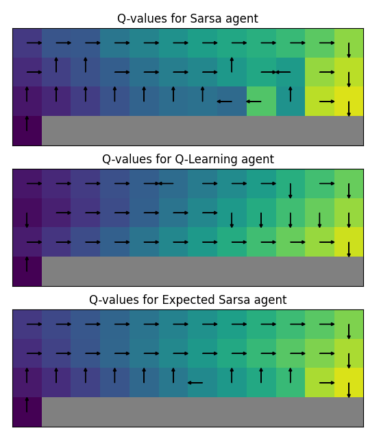

# RL fundamentals
Welcome to the RL Fundamentals course! This repository contains all the materials, assignments, and examples you'll 
need to master Reinforcement Learning concepts.

## Repository structure

- **assignments/**
  - Bandits: [bandits.md](assignments/bandits.md)
  - MDPs: [mdps.md](assignments/mdps.md)
  - Dynamic Programming: [dynamic_programming.md](assignments/dynamic_programming.md)
  - Monte Carlo: [monte_carlo.md](assignments/monte_carlo.md)
  - Temporal Difference: [temporal_difference.md](assignments/temporal_difference.md)
  - Planning: [planning.md](assignments/planning.md)
- **rl/**: Contains the core reinforcement learning algorithms and environment implementations.
- **exercises/**: Additional exercises to reinforce learning.
- **utils/**: Utility scripts and helper functions.

# What you'll implement
|     Topic      |               [K-Armed Bandits](assignments/bandits.md)               |                          [Analytic solutions to MDPs](assignments/mdps.md)                          | [Dynamic Programming](assignments/dynamic_programming.md) |
|:--------------:|:---------------------------------------------------------------------:|:---------------------------------------------------------------------------------------------------:|:---------------------------------------------------------:|
|                |  |                                           |   |
| **Algorithms** |  Investigate epsilon-greedy and optimistic initial value solutions.   | Expressing Bellman equations as simultaneous equations; using `np.linalg` to solve for state values |      Implement policy iteration and value iteration       |
| **Environments** |                  The "KAB Testbed" (Sutton & Barto)                   |           [Frozen Lake](https://gymnasium.farama.org/environments/toy_text/frozen_lake/)            |            Jack's Car Rental (Sutton & Barto)             |


|     Topic      |                                        Monte Carlo                                        |                                Temporal Difference                                 |                     Planning                     |
|:--------------:|:-----------------------------------------------------------------------------------------:|:----------------------------------------------------------------------------------:|:------------------------------------------------:|
|                |                                                    |                                     |  |
| **Algorithms** | Implement first-visit MC prediction; MC control (exploring starts, on-policy, off-policy) |                   Implement Sarsa, Q-learning and Expected Sarsa                   |           Implement Dyna-Q and Dyna-Q+           |
| **Environments** |        [Blackjack](https://gymnasium.farama.org/environments/toy_text/blackjack/)         | [Cliff Walking](https://gymnasium.farama.org/environments/toy_text/cliff_walking/) |         Planning Mazes (Sutton & Barto)          |

## Getting started

1. **Clone the Repository:**

    ```bash
    git clone https://github.com/<yourusername>/rl-fundamentals-assignments.git
    ```

2. **Navigate to the Repository:**

    ```bash
    cd rl-fundamentals-assignments
    ```

3. **Create a Virtual Environment:**

    Make sure you have Python installed. Then, create a virtual environment:

    ```bash
    python -m venv venv
    ```

4. **Activate the Virtual Environment:**

    - On **Windows**:

      ```bash
      venv\Scripts\activate
      ```

    - On **macOS/Linux**:

      ```bash
      source venv/bin/activate
      ```

5. **Install the Required Packages:**

    Once the virtual environment is activated, run:

    ```bash
    pip install -r requirements.txt
    ```

6. **Add the Project Directory to PYTHONPATH:**

  If you encounter an error like ModuleNotFoundError: No module named 'rl', it is likely that the rl folder is not part of your Python path. To resolve this, you can add the project directory to your Python path:
  
  1. ***Temporary Solution:***
  
    Windows:
    
    Open a terminal in the main directory of the course project (where the rl folder is located).
    
    Run the following command:
    
    ```set PYTHONPATH=%PYTHONPATH%;%CD%```
    
    Mac/Linux:
    
    In a terminal, navigate to the project's main directory (where the rl folder is located).
    
    Run the following command:
    
    ```export PYTHONPATH="${PYTHONPATH}:$(pwd)"```
  
  2. ***Permanent Solution:***
    
    Windows: Add the directory path to your system environment variables in "System Properties" -> "Environment Variables".
    
    Mac/Linux: Add the export `PYTHONPATH="${PYTHONPATH}:$(pwd)"` line to your shell configuration file (e.g., .bashrc, .zshrc). This will ensure that the path is set every time you open a terminal.

7. **Explore Assignments:**

    Each assignment has its own markdown file within the `assignments/` directory. Navigate to the desired assignment folder and follow the guidelines to complete the tasks.

## Additional resources

- **Books:**
  - The Bible! Sutton, R. S., & Barto, A. G. (2018). *Reinforcement Learning: An Introduction* (Second Edition).
  - Most of the environments encountered in this course originate from this amazing and seminal book (e.g. Jack's Car Hire), and it has informed luminaries from Demis Hassabis and David Silver at DeepMind to Andrew Ng and Yann LeCun.
  - If you are enjoying this course, I would encourage you to buy *Reinforcement Learning: An Introduction* as it is well worth the investment.

- **Documentation:**
  - [Gymnasium Documentation](https://gymnasium.farama.org/)
  - [NumPy Documentation](https://numpy.org/doc/)
  - [Pandas Documentation](https://pandas.pydata.org/docs/)
  - [Matplotlib Documentation](https://matplotlib.org/stable/contents.html)

## Contact

For any questions or issues, please contact [Tom Walker](mailto:tom.walker.univ@gmail.com).
